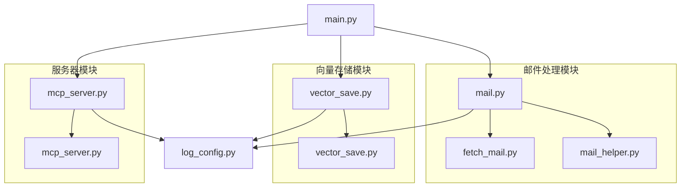

## 项目架构说明

本项目采用模块化设计，主要分为以下三大模块：

### 1. 邮件处理模块
- **fetch_mail.py**: 负责从邮件服务器获取邮件
- **mail_helper.py**: 提供邮件处理相关工具函数
- **mail.py**: 邮件处理主模块，协调各子模块工作

### 2. 向量存储模块
- **vector_save.py**: 负责将处理后的数据存储到向量数据库中

### 3. 服务器模块
- **mcp_server.py**: 提供基于FastMCP的API服务，支持文档查询等功能

所有模块共享日志配置模块(log_config.py)，确保统一的日志记录格式和输出。